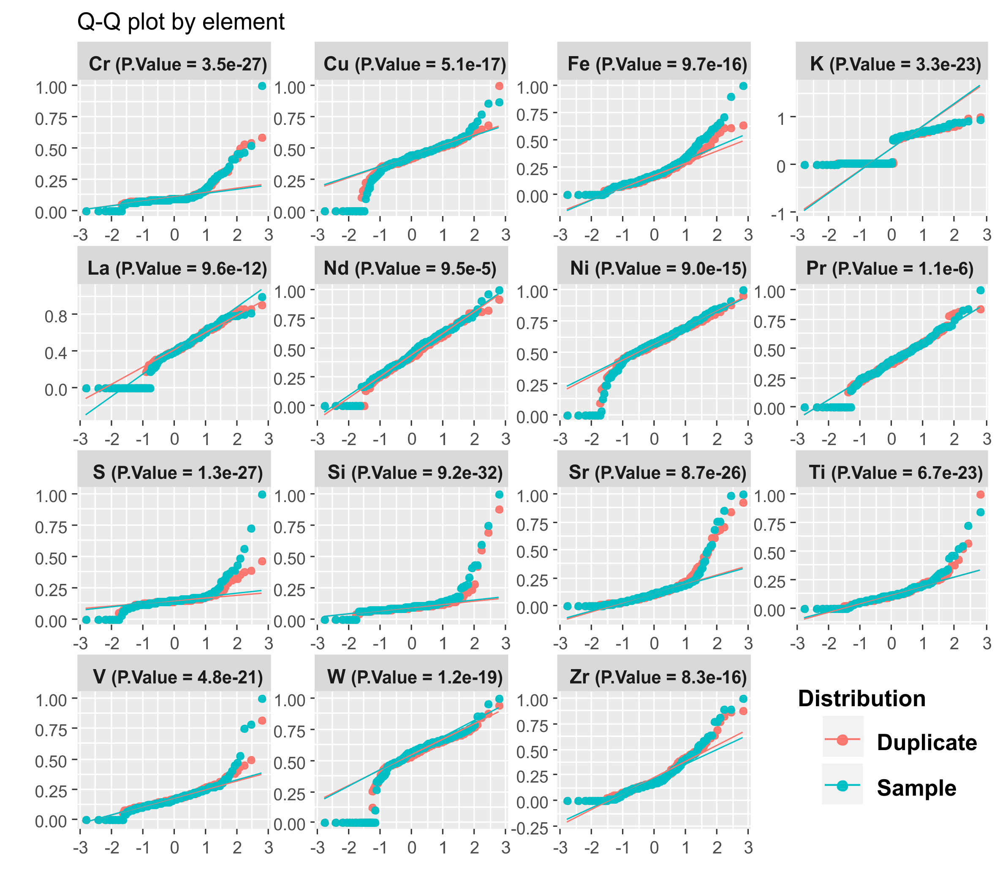
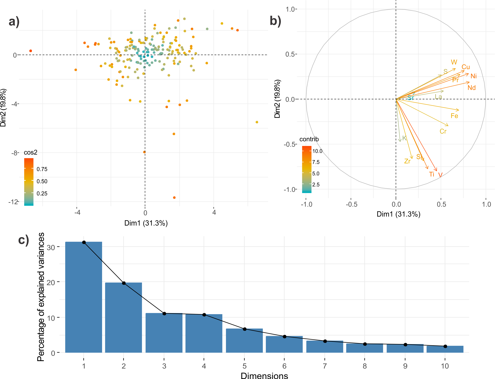

# K-Means applied to fine-grained rocks clustering

This codes is part of the "Principal Component Analysis and K-Means clustering based on X-Ray Fluorescence Data in fine-grained meta volcano-sedimentary rocks from the Rio Salitre Greenstone Belt, Brazil" written by the team* of the Geological Survey of Brazil.

*Guilherme Ferreira da Silva
Directory of Geology and Mineral Resources, Geological Survey of Brazil – CPRM, 
guilherme.ferreira@cprm.gov.br

  # 1. SETTINGS
  ## 1.1 Loading packages
``` R
library(readr)
library(dplyr)
library(ggplot2)
library(hrbrthemes)
library(corrplot)
library(factoextra)
set.seed(123)
```
  ## 1.2 Data Preparation
Reading data
``` R
df_raw <- read_tsv("Salitre.txt")

head(df_raw)
```
Output:

```
# A tibble: 6 x 56
  Index Date  Time  Duration SAMPLE TYPE  CORE  Mo    Zr    Sr    U     Rb    Th    Pb    Au    Se   
  <int> <chr> <tim>    <dbl> <chr>  <chr> <chr> <chr> <chr> <chr> <chr> <chr> <chr> <chr> <chr> <chr>
1   124 18/1~ 15:43     121. apa20~ S     APA2~ <LOD  92.11 55.05 <LOD  12.51 <LOD  <LOD  <LOD  <LOD 
2   125 18/1~ 15:46     122. apa20~ D     APA2~ <LOD  89.11 52.90 <LOD  10.48 <LOD  <LOD  <LOD  <LOD 
3   126 18/1~ 15:51     121. apa20~ S     APA2~ <LOD  63.71 36.59 <LOD  13.14 <LOD  <LOD  <LOD  <LOD 
4   127 18/1~ 15:54     122. apa20~ D     APA2~ <LOD  69.72 38.04 <LOD  14.53 <LOD  17.10 <LOD  <LOD 
5   131 18/1~ 16:08     123. apa20~ S     APA2~ <LOD  91.59 61.95 <LOD  14.90 <LOD  20.39 <LOD  <LOD 
6   132 18/1~ 16:11     121. apa20~ D     APA2~ <LOD  73.79 90.90 <LOD  11.23 <LOD  <LOD  <LOD  <LOD 
# ... with 40 more variables: As <chr>, Hg <chr>, Zn <chr>, W <chr>, Cu <chr>, Ni <chr>, Co <chr>,
#   Fe <chr>, Mn <chr>, Cr <chr>, V <chr>, Ti <chr>, Sc <chr>, Ca <chr>, K <chr>, S <chr>, Nd <chr>,
#   Pr <chr>, Ce <chr>, La <chr>, Ba <chr>, Sb <chr>, Sn <chr>, Cd <chr>, Pd <chr>, Ag <chr>,
#   Bal <chr>, Nb <chr>, Y <chr>, Bi <chr>, Re <chr>, Ta <chr>, Hf <chr>, Al <chr>, P <chr>, Si <chr>,
#   Cl <chr>, Mg <chr>, Cs <chr>, Te <chr>
```
Discarding irrelevant Factor Variables
``` R
trash <- c("Index", "Date", "Duration", "CORE", "Time")

df_raw <- df_raw %>%
  select(-trash)
```
Adjusting the class of variables

``` R
for (i in 3:length(df_raw)) {
  df_raw[[i]] <- as.numeric(df_raw[[i]])
 }
```

Statistical summary

``` R
do.call(rbind,lapply(df_raw, summary))
```
Output:
```
       Min.        1st Qu.      Median      Mean               3rd Qu.      Max.        NA's 
SAMPLE "384"       "character"  "character" "384"              "character"  "character" "384"
TYPE   "384"       "character"  "character" "384"              "character"  "character" "384"
Mo     "7.6"       "8.98"       "11.095"    "12.8541666666667" "15.0075"    "26.36"     "372"
Zr     "11.34"     "61.115"     "83.57"     "111.25364902507"  "149.77"     "427.97"    "25" 
Sr     "4.21"      "15.235"     "25.33"     "32.4919073569482" "35.89"      "201.35"    "17" 
U      "1.56"      "1.82"       "1.99"      "2.0496"           "2.2325"     "3.1"       "334"
Rb     "3.62"      "14.51"      "25.025"    "25.1770289855072" "35.495"     "56.62"     "108"
Th     "8.37"      "15.035"     "16.72"     "17.3511904761905" "18.93"      "28.53"     "300"
Pb     "9.35"      "19.1375"    "22.325"    "23.9015238095238" "25.98"      "84.47"     "174"
Au     NA          NA           NA          "NaN"              NA           NA          "384"
Se     NA          NA           NA          "NaN"              NA           NA          "384"
As     "13.01"     "17.38"      "20.06"     "27.3671052631579" "24.5175"    "217.29"    "270"
Hg     NA          NA           NA          "NaN"              NA           NA          "384"
Zn     "31.3"      "47.5375"    "53.67"     "49.585"           "55.7175"    "59.7"      "380"
W      "616.61"    "1742.85"    "1978.205"  "1959.95593567251" "2190.1575"  "3215.18"   "42" 
Cu     "249.05"    "634.34"     "718.05"    "711.211218836565" "784"        "1453.73"   "23" 
Ni     "128.05"    "1357.05"    "1565.04"   "1557.3866395664"  "1795.57"    "2647.17"   "15" 
Co     "206.24"    "365.05"     "422.655"   "453.487837837838" "524.9875"   "1105.8"    "236"
Fe     "1927.49"   "10079.94"   "15340.78"  "18137.0905205479" "22647.34"   "79021.55"  "19" 
Mn     NA          NA           NA          "NaN"              NA           NA          "384"
Cr     "9.17"      "13.85"      "14.99"     "19.1590190735695" "18.805"     "114.43"    "17" 
V      "2.18"      "4.09"       "5"         "5.38046575342466" "6.1"        "22.78"     "19" 
Ti     "5.63"      "39.5725"    "56.285"    "69.8194972067039" "87.8725"    "473.67"    "26" 
Sc     "1.3"       "2.29"       "2.665"     "3.25628048780488" "3.2225"     "20.79"     "56" 
Ca     "24.29"     "191.2"      "1255.29"   "6449.69617777778" "1692.59"    "84425.73"  "159"
K      "583.01"    "653.32"     "10150.74"  "6855.27758807588" "12519.1"    "19073.41"  "15" 
S      "1712.74"   "5789.32"    "6317.69"   "6934.92352303523" "7014.25"    "38275.17"  "15" 
Nd     "335.07"    "598.45"     "718.26"    "741.992049861496" "882.24"     "1390.39"   "23" 
Pr     "231.09"    "378.915"    "465.04"    "475.417606837607" "552.21"     "966.06"    "33" 
Ce     "167.26"    "259.355"    "304.11"    "313.176443661972" "348.2375"   "778.72"    "100"
La     "174.33"    "262.265"    "306.2"     "317.374723127036" "368.62"     "568.61"    "77" 
Ba     "448.32"    "1083.74"    "1287.92"   "1365.79869918699" "1653.97"    "2492.74"   "15" 
Sb     "93.54"     "170.74"     "196.86"    "198.737057220708" "225.295"    "344.53"    "17" 
Sn     "55.4"      "104.82"     "122.83"    "123.562179836512" "140.995"    "220.15"    "17" 
Cd     "28.93"     "56.5875"    "67.785"    "69.4771388888889" "81.6125"    "138.33"    "24" 
Pd     "12.15"     "21.01"      "25.3"      "25.7166666666667" "28.82"      "50.67"     "171"
Ag     NA          NA           NA          "NaN"              NA           NA          "384"
Bal    "703458.13" "906263.75"  "921082.25" "914212.835311653" "930563.81"  "952496.19" "15" 
Nb     "4.57"      "7.985"      "10.71"     "12.766577540107"  "14.485"     "42.41"     "197"
Y      "1.51"      "1.7075"     "1.95"      "2.21128205128205" "2.38"       "8.81"      "228"
Bi     NA          NA           NA          "NaN"              NA           NA          "384"
Re     NA          NA           NA          "NaN"              NA           NA          "384"
Ta     NA          NA           NA          "NaN"              NA           NA          "384"
Hf     NA          NA           NA          "NaN"              NA           NA          "384"
Al     "2797.26"   "12010.1425" "15290"     "17282.9158333333" "23742.2025" "33881.68"  "372"
P      "1042.74"   "2082.51"    "2360.42"   "2368.85666666667" "2674.88"    "3722.3"    "15" 
Si     "12925.2"   "19868.68"   "22684.15"  "26120.9617886179" "25816.76"   "175964.19" "15" 
Cl     "2819.57"   "8637.28"    "9358.06"   "9208.16154471545" "10027.74"   "12864"     "15" 
Mg     NA          NA           NA          "NaN"              NA           NA          "384"
Cs     "311.73"    "465.5225"   "518.355"   "517.898403141361" "572.1175"   "840.62"    "2"  
Te     "127.08"    "230.3075"   "263.365"   "262.254842931937" "292.2425"   "448.57"    "2" 
```
Filtering for variables that have at least 75% os values higher than lower detection limit
``` R
cut <- .75
df <- df_raw %>%
  select_if(~sum(!is.na(.x)) >= (cut * nrow(df_raw)))
```
Replacing <LDL values to 1/2 the minimun of each variable
``` R
minimo <- {}
for (i in 3:length(df)) {
  minimo[i] <- min(df[[i]], na.rm = TRUE)  
}

for (i in 3:length(df)) {
  df[[i]] <- replace_na(df[[i]], .5*minimo[[i]])
}
```

# 2. DATA SCALING 

## 2.1 Amplitude normalization
``` R
normalize <- function(x) {
  return ((x - min(x, na.rm = TRUE)) / (max(x, na.rm = T) - min(x, na.rm = T)))
}
labels <- df %>% select(SAMPLE, TYPE)

df_norm <- df %>%
  select(-SAMPLE) %>%
  select(-TYPE) %>%
  sapply(FUN = normalize)

df_norm <- bind_cols(labels, as_data_frame(df_norm))

head(df_norm)
```
Output:
```
# A tibble: 6 x 27
  SAMPLE TYPE     Zr    Sr     W    Cu    Ni     Fe     Cr      V     Ti     Sc      K     S    Nd
  <chr>  <chr> <dbl> <dbl> <dbl> <dbl> <dbl>  <dbl>  <dbl>  <dbl>  <dbl>  <dbl>  <dbl> <dbl> <dbl>
1 apa20~ S     0.205 0.266 0.599 0.451 0.549 0.0793 0.0843 0.0862 0.0618 0.0943 0.0201 0.159 0.356
2 apa20~ D     0.198 0.255 0.590 0.452 0.628 0.0828 0.0857 0.114  0.0524 0.0650 0.0182 0.135 0.427
3 apa20~ S     0.137 0.173 0.529 0.368 0.475 0.129  0.0705 0.152  0.0726 0.0631 0.0210 0.140 0.524
4 apa20~ D     0.152 0.180 0.531 0.387 0.519 0.113  0.0752 0.144  0.0763 0.0854 0.0217 0.136 0.444
5 apa20~ S     0.203 0.300 0.538 0.416 0.473 0.118  0.0811 0.202  0.0990 0.136  0.0219 0.127 0.585
6 apa20~ D     0.161 0.446 0.503 0.372 0.483 0.0839 0.0719 0.0982 0.0639 0      0.0197 0.129 0.386
# ... with 12 more variables: Pr <dbl>, La <dbl>, Ba <dbl>, Sb <dbl>, Sn <dbl>, Cd <dbl>, Bal <dbl>,
#   P <dbl>, Si <dbl>, Cl <dbl>, Cs <dbl>, Te <dbl>
```
## 2.2 Log Transformation
``` R
labels <- df %>% select(SAMPLE, TYPE)

df_log <- df %>%
  select(-SAMPLE) %>%
  select(-TYPE) %>%
  sapply(FUN = log10)

df_log <- bind_cols(labels, as_data_frame(df_log))
```
Output:
```
# A tibble: 6 x 27
  SAMPLE TYPE     Zr    Sr     W    Cu    Ni    Fe    Cr     V    Ti     Sc     K     S    Nd    Pr
  <chr>  <chr> <dbl> <dbl> <dbl> <dbl> <dbl> <dbl> <dbl> <dbl> <dbl>  <dbl> <dbl> <dbl> <dbl> <dbl>
1 apa20~ S      1.96  1.74  3.31  2.86  3.17  3.85  1.14 0.471  1.50  0.407  2.83  3.83  2.78  2.57
2 apa20~ D      1.95  1.72  3.31  2.86  3.23  3.87  1.15 0.551  1.44  0.292  2.80  3.77  2.84  2.59
3 apa20~ S      1.80  1.56  3.27  2.79  3.11  4.04  1.09 0.641  1.57  0.283  2.84  3.78  2.91  2.85
4 apa20~ D      1.84  1.58  3.27  2.81  3.15  3.99  1.11 0.625  1.59  0.375  2.84  3.77  2.85  2.75
5 apa20~ S      1.96  1.79  3.27  2.83  3.11  4.01  1.13 0.739  1.69  0.529  2.85  3.75  2.95  2.68
6 apa20~ D      1.87  1.96  3.25  2.79  3.12  3.88  1.10 0.508  1.52 -0.187  2.82  3.75  2.81  2.60
# ... with 11 more variables: La <dbl>, Ba <dbl>, Sb <dbl>, Sn <dbl>, Cd <dbl>, Bal <dbl>, P <dbl>,
#   Si <dbl>, Cl <dbl>, Cs <dbl>, Te <dbl>
```
# 3. DATA MANIPULATION
## 3.1 Splitting samples and duplicates
``` R
sam <- df_norm %>%
  filter(TYPE == "S")

dup <- df_norm %>%
  filter(TYPE == "D")
```

## 3.2 Converting in Long Data Frame
``` R
descarte <- c("Cl", "P", "Bal", "Sc", "Sn", "Cd", "Sb", "Te", "Ba", "Cs") # ver código abaixo

sam <- sam %>% select(-descarte)

dup <- dup %>% select(-descarte)

s_long <- sam %>%
  gather(key = "element", value = "measure", 3:length(sam), na.rm = TRUE)
d_long <- dup %>%
  gather(key = "element", value = "measure", 3:length(sam), na.rm = TRUE)

long <- full_join(s_long, d_long) %>%
  rename(Group = TYPE)
```

## 3.3 Selecting only the numerical variables

``` R
df_num <- select(sam,-SAMPLE) %>%
  select(-TYPE)

write.csv(df_num, "salitre_norm.csv")
```
# 4. STATISTICAL SIGNIFICANCE VERIFICATION

## 4.1 Check of distribution
Shapiro-Wilk test (Shapiro & Wilk, 1965; Razali & Wah, 2011)

For alpha defined as 5%, this test checks if the data sample is normally distributed # /t
Null hypothesis (H0): The data sample is normally distributed
Alternative hypothesis (H1): The data sample has another distribution

``` R
t(do.call(rbind, 
          lapply(X = df %>% select(-SAMPLE, -TYPE), 
                 function(x) shapiro.test(x)[c("statistic", "p.value")]
          )))
```
Output:
```
          Zr           Sr           W            Cu           Ni           Fe           Cr          
statistic 0.8922746    0.6953068    0.8343817    0.8757685    0.9050847    0.8931482    0.6540958   
p.value   8.357584e-16 8.777475e-26 1.293297e-19 5.112535e-17 9.089255e-15 9.770249e-16 3.519157e-27
          V            Ti           Sc           K            S           Nd           Pr          
statistic 0.8077025    0.768408     0.6508929    0.7614976    0.6405334   0.9818664    0.9724514   
p.value   4.828141e-21 6.770853e-23 2.776015e-27 3.387864e-23 1.30379e-27 9.504289e-05 1.150519e-06
          La           Ba           Sb           Sn           Cd           Bal         P           
statistic 0.9364157    0.9769057    0.9512631    0.9617951    0.9707346    0.3565725   0.931491    
p.value   9.635029e-12 8.306087e-06 6.013767e-10 1.881325e-08 5.620156e-07 1.40641e-34 2.816869e-12
          Si           Cl           Cs           Te        
statistic 0.4730813    0.7995515    0.9845759    0.9905358 
p.value   4.281468e-32 1.893626e-21 0.0004077478 0.01435178

```

## 4.2 Equivalence of data and duplicates
Kruskal-Wallis (Kruskal & Wallis, 1952)

For alhpa defined as 5%, this test for non-parametric data checks if sample and duplicates are originated from the same distribution. 
Null hypothesis (H0): Sample and duplicate have the same dristibution
Alternative hypothesis (H1): Sample and duplicate do not come from the same dristibution
``` R
t(do.call(rbind,
          lapply(X = df %>% select(-SAMPLE),
                 g = factor(df$TYPE),
                 function (x, g) kruskal.test(x, g)[c("statistic",
                                                      "p.value")])))
```
Output:

```
          TYPE       Zr         Sr         W         Cu        Ni        Fe        Cr        
statistic 383        0.06917833 0.02232867 0.7173547 0.1936311 0.2933421 1.135893  0.07686608
p.value   2.7658e-85 0.7925369  0.8812161  0.397013  0.6599115 0.5880867 0.2865218 0.7815902 
          V         Ti        Sc        K         S         Nd        Pr         La         Ba       
statistic 0.1944266 0.2265028 2.487362  0.284446  2.002724  0.8635429 0.08772136 0.03776917 0.1948168
p.value   0.6592577 0.6341291 0.1147639 0.5938019 0.1570168 0.3527491 0.7670942  0.8459074  0.6589375
          Sb        Sn        Cd         Bal        P          Si        Cl        Cs        Te      
statistic 0.1516571 0.560968  0.07235625 3.591698   0.06819939 1.719424  1.859628  1.505758  1.815892
p.value   0.6969568 0.4538705 0.7879365  0.05806888 0.7939767  0.1897673 0.1726677 0.2197875 0.177803
```

# 5. DATA VISUALIZATION

# 5.1 QQ-plot for selected elements

``` R
ggplot(long, aes(sample = measure, col = Group)) + 
  geom_qq(alpha = .6) + geom_qq_line() + theme(
    legend.position= c(.85,.1),
    panel.spacing = unit(.1, "lines"),
    strip.text.x = element_text(size = 12)
  ) + xlab("") + ylab("") +
  labs(title = 'Q-Q plot by element') +
  scale_fill_continuous(name = "Group", labels = c("Duplicate", "Measure")) +
  facet_wrap(~element, scale = "free") + scale_color_discrete(name = "Group", labels = c("Duplicate", "Measure"))
```
Output:
 
# 5.2 Density plot of Sample and Duplicate

``` R
ggplot(long, aes(x = measure, y = ..density.., fill = Group)) +
  geom_density(alpha = .6) +
  labs(title = 'Probability density by element') +  theme(
    legend.position= c(.85,.05),
    panel.spacing = unit(.1, "lines"),
    strip.text.x = element_text(size = 10)
  ) + facet_wrap(~element, scale = "free") + xlab("") + ylab("") + 
  scale_fill_discrete(
    name = "Group",
    labels = c("Duplicate", "Measure")
  )
```
Output:
 

# 6. NUMERICAL MODELLING
# 6.1 Correlation matrix
AS data is non-parametric, we choose to run the correlation by Spearman ranked method

```R
M <- cor(df_num, method = "spearman")

library(corrplot)

col <- colorRampPalette(c("#BB4444", "#EE9988", "#FFFFFF", "#77AADD", "#4477AA"))
corrplot(M, method="color",# col=col(200),  
         type="upper", order="hclust", 
         addCoef.col = "black", # Add coefficient of correlation
         tl.col="black", tl.srt=45, #Text label color and rotation
         # Combine with significance
         #p.mat = p.mat, sig.level = 0.01, insig = "blank", 
         # hide correlation coefficient on the principal diagonal
         diag=FALSE,
         tl.cex = 1, # tamanho da fonte dos labels
         tl.offset = 1.1, # offset do nome das colunas em relação a matriz
         number.font = 2,
         number.digits = 2
)
```
Output:
 

# 6.2 Principal Components Analysis
```R
df_pca <- prcomp(df_num, center = TRUE, scale. = TRUE)
fviz_eig(df_pca)

# Individuals

fviz_pca_ind(df_pca,
             col.ind = "cos2", # Color by the quality of representation
             gradient.cols = c("#00AFBB", "#E7B800", "#FC4E07"),
             repel = F,      # Avoid text overlapping
             axes = c(1,2), #controla quais eixos devem ser mostrados na figura
             geom = c("point")
             )

# Eigenvalues

fviz_pca_var(df_pca,
             col.var = "contrib", # Color by contributions to the PC
             gradient.cols = c("#00AFBB", "#E7B800", "#FC4E07"),
             repel = TRUE     # Avoid text overlapping
)

# Bi-plot

fviz_pca_biplot(df_pca, 
                #palette = "jco", 
                addEllipses = TRUE, label = "var")
               # col.var = "contrib", repel = TRUE,
                #legend.title = "Species") 
```
Output:


#####################################
# Hyperparameter tunning
#####################################

## Elbow method

set.seed(123)

fviz_nbclust(df_num, kmeans, method = "wss", k.max = 25)
## Silhoutte method

fviz_nbclust(df_num, kmeans, method = "silhouette", k.max = 25)

#####################################
# K-Means Clustering
#####################################

## Distance matrix

distance <- get_dist(df_num, method = "manhattan")


fviz_dist(distance, gradient = list(
  low = "#00AFBB", mid = "white", high = "#FC4E07"),
  show_labels = T, lab_size = 5, order = TRUE)

## Clustering

k3 <- kmeans(df_num, 
             centers = 3, 
             nstart = 50)

df_clus <- as.data.frame(k3["cluster"])

write.csv(k3["cluster"], "cluster.csv")

fviz_cluster(k3,
             data = df_num,
             axes = c(1,2))
# REFERENCES
## Papers
Kruskal, William H.; Wallis, W. Allen (1 de dezembro de 1952). Use of Ranks in One-Criterion Variance Analysis. Journal of the American Statistical Association. 47 (260): 583–621. ISSN 0162-1459. doi:10.1080/01621459.1952.10483441

Razali, Nornadiah; Wah, Yap Bee (2011). "Power comparisons of Shapiro–Wilk, Kolmogorov–Smirnov, Lilliefors and Anderson–Darling tests". Journal of Statistical Modeling and Analytics. 2 (1): 21–33

Shapiro, S. S.; Wilk, M. B. (1965). An analysis of variance test for normality (complete samples). Biometrika. 52 (3–4): 591–611. doi:10.1093/biomet/52.3-4.591. JSTOR 2333709. MR 0205384. p. 593

## Websites
Correlation Matrix
http://www.sthda.com/english/wiki/visualize-correlation-matrix-using-correlogram

PCA
https://towardsdatascience.com/dimensionality-reduction-does-pca-really-improve-classification-outcome-6e9ba21f0a32

PCA for Machine Learning
https://medium.com/apprentice-journal/pca-application-in-machine-learning-4827c07a61db

K-Means Clustering
https://uc-r.github.io/kmeans_clustering
